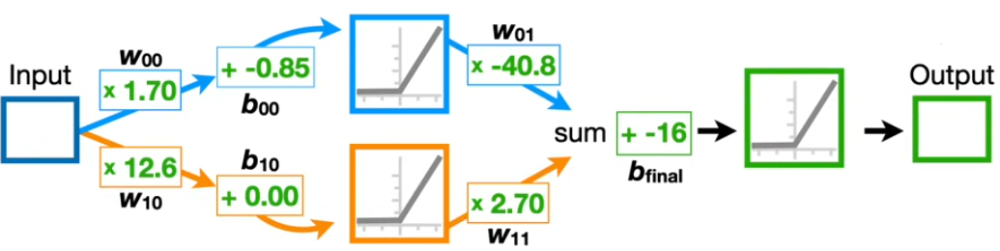
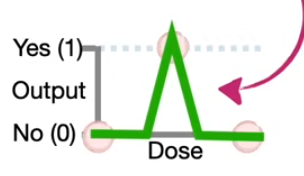

# PyTorch Fundamentals – Dose-Response Neural Network

This repository demonstrates a minimal neural network designed to learn a **single trainable parameter** (`b_final`) that shapes a biologically inspired **dose-response curve**.

Two training pipelines are provided:
- A pure **PyTorch** implementation
- A more modular **PyTorch Lightning** version with learning rate tuning

---

## 🧠 Model Architecture

The model is hardcoded with:
- Two parallel ReLU branches
- Fixed weights and biases in all layers
- A single **learnable final bias** (`b_final`) updated during training

The outputs of both branches are summed, offset by `b_final`, and passed through a final ReLU.

<p align="center">
  
</p>

---

## 📈 Target Output

The training data is synthetic and designed to produce a "bump" or "spike" pattern in response to input dose values:

- **Input doses:** `[0.0, 0.5, 1.0]`
- **Target outputs:** `[0.0, 1.0, 0.0]`

This shape mimics the idea that a certain dose yields a maximal response, while others yield none.

<p align="center">
  
</p>

---

## 📂 File Structure
```
├── images/
│ ├── model-diagram.png # Diagram of the fixed architecture
│ └── target-dose-response.png # Target spike/bump output
├── dose-model-pytorch.py # Plain PyTorch training script
├── dose-model-lightning.py # PyTorch Lightning version with LR tuning
└── README.md
```
---

## 🚀 Training Overview

### PyTorch Version (`dose-model-pytorch.py`)
- Optimizes only `b_final` using **SGD**
- Fixed learning rate `lr = 0.1`
- Simple training loop over the 3-point dataset

### Lightning Version (`dose-model-lightning.py`)
- Uses `pytorch-lightning` for modular training
- Performs **learning rate finding** with `lr_find()`
- Trains for up to 34 epochs with `DataLoader` on 300 synthetic samples (3 repeated × 100)

---

## 🧪 Example Output

After training, the model learns the optimal value for `b_final` that best fits the target dose-response shape. The script also generates a plot of the predicted curve using `matplotlib` and `seaborn`.

---

## 🛠️ Requirements

- Python 3.8+
- `torch`
- `matplotlib`
- `seaborn`
- `pytorch-lightning`

Install dependencies with:

```bash
pip install torch matplotlib seaborn lightning

